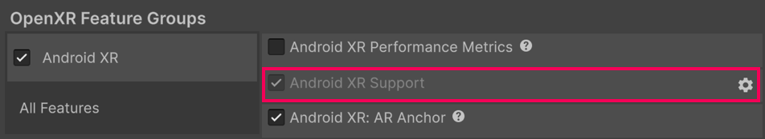

# Android XR Support

Understand the options available in the **Android XR Support** feature.

When you [Enable Android XR](xref:androidxr-openxr-project-setup#enable-unity-openxr-android-xr), you can use the **Android XR Support** feature to configure Android XR platform settings.

## Access the Android XR support window

To open the Android XR support window:

1. Open the **OpenXR** section of **XR Plug-in Management** (menu: **Edit** > **Project Settings** > **XR Plug-in Management** > **OpenXR**).
2. Under **All Features**, enable **Android XR Support**.
3. Use the **Gear** icon to open **Android XR Support** settings window.

 *Use the gear icon to open the Android XR Support window.*

## Settings reference

The following options are available in the **Android XR support** window:

| **Setting** | **Description** |
| :---------- | :-------------- |
| **Symmetric Projection (Vulkan)**  | If enabled, when the application begins it will create a stereo symmetric view that changes the eye buffer resolution based on the Inter-Pupillary Distance (IPD). Provides a performance benefit across all IPD values. |
| **Optimize Buffer Discards (Vulkan)** | Enable this setting to enable an optimization that allows 4x Multi Sample Anti Aliasing (MSAA) textures to be memoryless on Vulkan. |
| **Multiview Render Regions Optimizations (Vulkan)** | Choose whether you enable Multiview Render Regions optimization and the mode of Multiview Render Regions optimization. In Unity 6.2 and newer, the options are: **None**, **All Passes**, **Final Pass**. To learn more about this feature, refer to [Multiview Render Regions](xref:openxr-multiview-render-regions) (OpenXR). |

## Additional resources

* [Configure project settings](xref:androidxr-openxr-project-setup)
