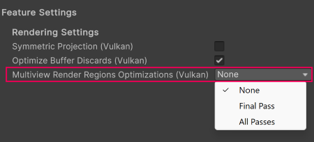

# Multiview Render Regions

This page supplements the [OpenXR multiview render regions](xref:openxr-multiview-render-regions) documentation and only contains information about APIs where Google's Android XR runtime exhibits platform-specific behavior.

## Enable Multiview Render Regions

The Multiview Render Regions feature is available in the [Android XR Support](xref:androidxr-openxr-androidxr-support) settings.

To enable the Multiview Render Regions feature:

1. Open the **OpenXR** section of **XR Plug-in Management** (menu: **Edit** > **Project Settings** > **XR Plug-in Management** > **OpenXR**).
2. Under **All Features**, enable **Android XR Support**.
3. Use the **Gear** icon to open **Android XR Support** settings.
4. Under **Rendering Settings**, select the **Multiview Render Regions Optimizations** mode. To understand the available options refer to [Multiview Render Regions Optimizations reference](https://docs.unity3d.com/Packages/com.unity.xr.openxr@1.15/manual/features/multiviewrenderregions.html#multiview-render-regions-optimizations-reference) (OpenXR).

 *Select the Multiview Render Regions Optimization mode in Rendering Settings.*

## Additional resources

* [Multiview Render Regions](xref:openxr-multiview-render-regions) (OpenXR)
* [Multiview Render Regions](xref:um-xr-multiview-render-regions) (Unity Manual)
