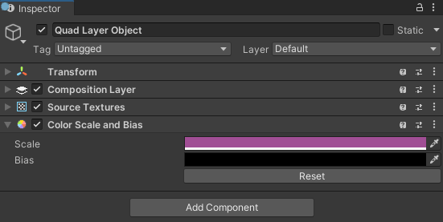
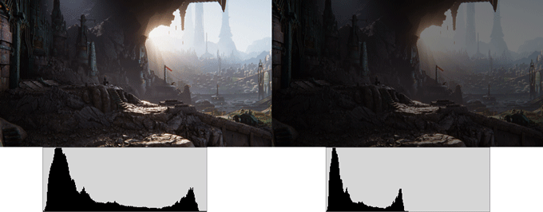
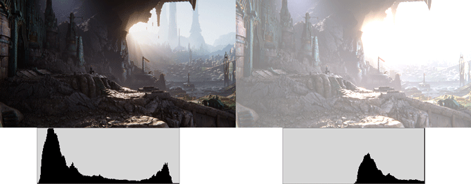
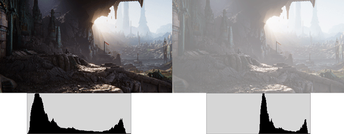

# Color Bias and Scale component

Add a __Color Bias and Scale__ extension component to apply a uniform color treatment to the layer. See [Add or remove a composition layer].

 *The Color Scale And Bias component Inspector*

| Property:| Function: |
|:---|:---|
| Scale| Multiplies the components of the rendered colors in the layer by the corresponding scale value. Must be a value between 0 and 1 if using RGB 0-1.0 or between 0 and 255 if using RGB 0-255.  Setting the R, G, B, A values using Color picker. Setting the value of 1.0 or 255 leaves a channel unaltered.|
| Bias| Adds the corresponding bias value to the components of the rendered colors in the layer. Must be a value between 0 and 1 if using RGB 0-1.0 or between 0 and 255 if using RGB 0-255.  Setting the R, G, B, A values using Color picker. Setting the value of 0 leaves a channel unaltered.   Bias values are added after scaling is applied. |
| Reset| Click Reset button to reset both Scale and Bias values to the default unaltered values. |

#### Scale

Scaling compresses the colors in a texture towards 0, which is the minimum luminosity for color channels and completely transparent for the alpha channel:

 *A scale of (.5,.5,.5,1) applied to a texture when using RGB 0-1.0 setting*

#### Bias

Bias shifts the colors in a texture towards 1, which is maximum luminosity for color channels completely opaque for the alpha channel. The result is clipped if it exceeds 1:

 *A bias of (.5,.5,.5,1) applied to a texture when using RGB 0-1.0 setting*

#### Scale and Bias

If you specify non-identity values for both scale and bias, scale is applied first:

 *A scale of (.5,.5,.5,1) and a bias of (.5,.5,.5,1) both applied to a texture*

### Color Bias and Scale Scene Emulation

Color scale and bias adjustments on the default scene layer can be emulated by the renderer in the Editor's Scene View and Game Veiw along with standalone platform builds. Emulation is only supported for **Color Scale and Bias** components associated with the default scene layer.

> [!NOTE]
> Composition Layers automatically adds the `Hidden/XRCompositionLayers/ColorScaleBias` shader used for emulation to the **Always Include Shader** list for standalone builds.

#### Built-in Render Pipeline

> [!IMPORTANT]
> In Unity 6.5 and newer, the Built-In Render Pipeline is deprecated and will be made obsolete in a future release. For more information, refer to [Migrating from the Built-In Render Pipeline to URP](https://docs.unity3d.com/6000.5/Documentation/Manual/urp/upgrading-from-birp.html) and [Render pipeline feature comparison](https://docs.unity3d.com/6000.5/Documentation/Manual/render-pipelines-feature-comparison.html).

To implement the color and scale bias effect in the Built-in Render Pipeline, Composition Layers automatically adds a `EmulatedColorScaleBias` component to the main camera when the **Color Scale and Bias** component is enabled on the default layer.

#### Universal Render Pipeline (URP)

In URP, color bias and scale emulation is implemented with a **Renderer Feature**.
The `EmulationColorBiasScalePass` (ScriptableRendererPass) is automatically added via the `ScriptableRenderer.EnqueuePass()` when the **Color Scale and Bias** component is enabled on the default layer.

#### High Definition Render Pipeline (HDRP)

 The Composition Layers package does not support color scale and bias emulation when using HDRP.

[Add or remove a composition layer]: xref:xr-layers-add-layer
