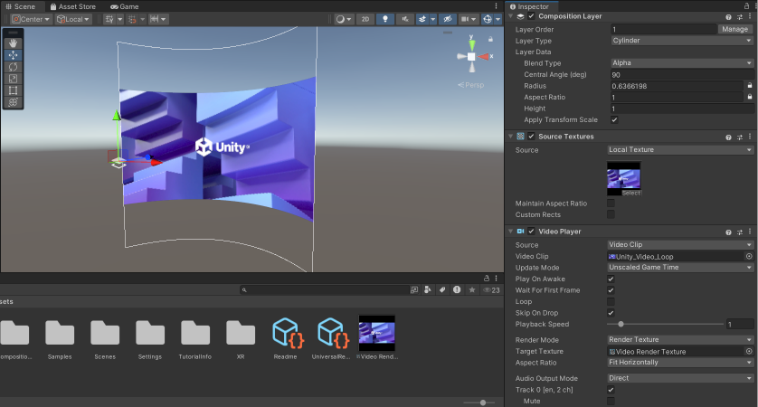

# Display video on composition layers

You can use Composition Layers to display high resolution videos in a Head-Mounted Display (HMD) at full resolution. With Composition Layers, the resolution isn't limited to the resolution of the Eye Buffer, or affected by distortion and sampling from the render pipeline.

You can display video configured through the Unity Editor or incorporate native content sources, such as Android Surfaces.

## Display Unity-rendered video

Refer to the following sections to understand the [Video types](#video-types) you can use with Unity and composition layers, and [Add video to a composition layer](#add-video-to-a-composition-layer).

### Video types

The following table describes the recommended composition layer for different types of video:

| Video type       | Composition layer    |
| :--------------- | :------------------- |
| Rectangle video  | Quad or Cylinder     |
| 360 degree video | Equirect             |
| Stereo video     | Projection           |

Refer to [Composition layer component](xref:xr-layers-base-component) for more information about the types of composition layer.

### Add video to a composition layer

To add a video to a composition layer, you must first:
* [Import your video file](https://docs.unity3d.com/6000.0/Documentation/Manual/video-clips-use.html) into your Unity project.
* [Create a composition layer](xref:xr-layers-add-layer) of appropriate display. Refer to [Video types](#video-types) to choose an appropriate composition layer for your video type.

Follow these steps to display your video on the composition layer:
1. Add a **Video Player** component to a GameObject (**Hierarchy** window: Right-click on your chosen GameObject > **Video** > **Video Player**).
2. In the **Inspector** window of the **Video Player** component, select your imported video file in the **Video Clip** field.
3. Go to **Assets** > **Create** > **Rendering** > **Render Texture** to create a new Render Texture.
4. Open the **Video Player** component and view it in the **Inspector** window.
5. In the **Target Texture** field, assign your custom Render Texture you created in step 3.
6. Open the composition layer you created in the **Inspector** window.
7. In the **Source Textures** component, under **Source**, select **Local Texture** and add the Render Texture you created in step 3.

When you enter Play mode, you can now observe the video clip displayed on the composition layer.

 *Composition layer settings configured to display a video clip.*

> [!NOTE]
> The video clip will not display on the composition layer until you enter Play mode for the first time, after which the first frame on the video will display on the Composition Layer in the **Scene** view and the **Game** view.

## Display Android Surface video

When developing for Android, you can use Android Surfaces to efficiently display video. Refer to [Display Android Surface Content](xref:xr-layers-android-surface) for more information.