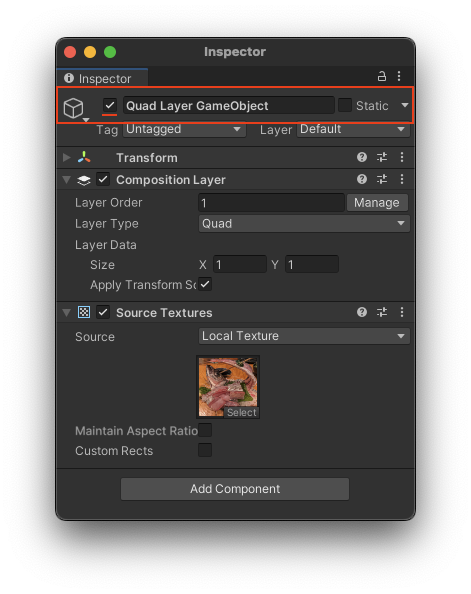

# Enable and disable layers

Enable and disable a composition layer by activating or deactivating its parent GameObject or the Component itself.

## In the Editor

In the Editor, you can enable or disable the parent GameObject in the Inspector by toggling the checkbox next to the GameObject name field.



An inactive GameObject remains in the scene and can be activated [at runtime](#at-runtime).

Refer to [Deactivate GameObjects](xref:DeactivatingGameObjects) in the Unity Manual for general information about managing GameObject state.

Alternately, you can enable or disable the **CompositionLayer** MonoBehaviour on its own by toggling the checkbox next to **CompositionLayer** in the inspector. This leaves the parent GameObject, any child GameObjects, and other components active.

## At runtime

At runtime, use the GameObject [SetActive](xref:UnityEngine.GameObject.SetActive(System.Boolean)) method to control whether a layer is enabled or disabled.

In the following code, `layer` is a reference to a [CompositionLayer](xref:Unity.XR.CompositionLayers.CompositionLayer) component:

``` csharp
// Enable
layer.gameObject.SetActive(true);

// Disable
layer.gameObject.SetActive(false);
```

To enable or disable a **CompositionLayer** MonoBehaviour without changing the state of its parent GameObject, set the `enabled` property:

``` csharp
// Enable
layer.enabled = true;

// Disable
layer.enabled = false;
```

> [!NOTE]
> The state of the parent GameObject takes precedence over the state of any MonoBehaviours. When you set a GameObject to inactive, a MonoBehaviour of that GameObject won't receive updates even if its own state is enabled.
