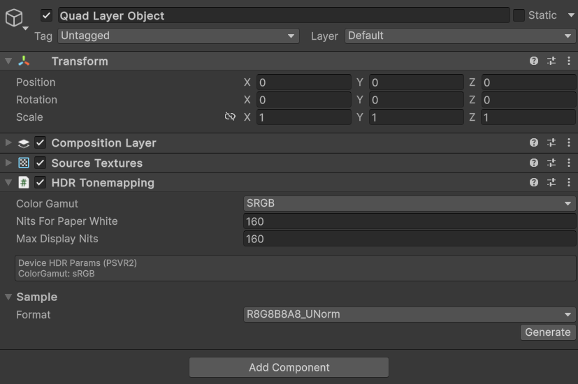
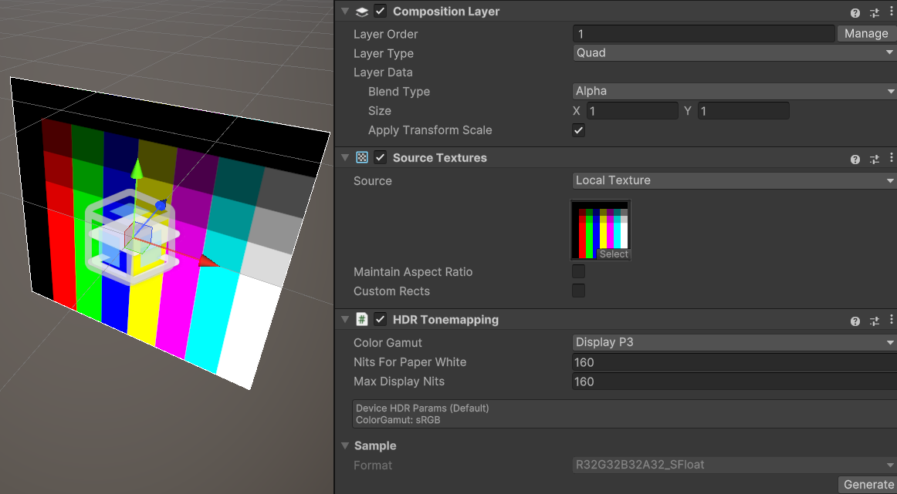
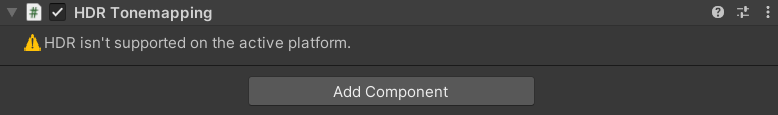

# HDR Tonemapping component

Add an **HDR Tonemapping** extension component to a layer to support HDR rendering. It is used as the properties for the HDR Tonemapping on the XR Plugin side to function properly. See [Add or remove a composition layer].

> [!TIP]
> This feature should only be used with HDR-encoded textures. (Including render textures.)
> This component isn't turned off regardless of texture format, so if you do not need it, disable it manually.
> You do not need to use this component with linear textures. If not set, the texture is treated as linear texture with appropriate **Nits For Paper White**.For example, SDR textures are treated as Rec709 and **Nits For Paper White** as 80 (100 on Metal).

 *The HDR tonemapping component Inspector*

| Property:| Function: |
|:---|:---|
| Color Gamut | The color gamut of the source texture. The source texture is treated as encoded with this color gamut.|
| Nits For Paper White|The base luminance of a white paper surface in nits or candela per square meter (cd/m2) of the source texture.|
| Max Display Nits|Set the maximum input luminance of the source texture.|
| Format (Sample)| The texture format to use for the generated sample image. |
| Generate (Sample)| Click **Generate** to create a sample HDR-encoded image and assign to the **Source Textures** component.|

#### Color Gamut

For correct HDR rendering, you must specify the color gamut used by the source texture. Supported color spaces include:  sRGB, Rec709, Rec2020, DisplayP3, HDR10, DolbyHDR, and P3D65G22. If used for linear textures, set Rec709 and appropriate **Nits For Paper White**.

#### Sample image generator

The component can generate sample HDR image textures to help you test which HDR formats are supported on a platform.
To create a sample HDR texture, choose the desired texture format in the **Sample** section of the component Inspector and click the **Generate** button.
This operation does not overwrite the current source texture. When this is done, the source texture is replaced with a sample texture. This sample texture isn't saved as asset, but is stored in the scene.

 *The sample texture image with Sample image generator.*

#### Limitation

Need to install HDR supported XR plugin on XR Plugin Management.
This component is disabled & hidden in environments where the XR plugin(device) does not support HDR.

 *The HDR tonemapping component Inspector in environments where HDR is unsupported.*

> [!TIP]
> There are no supported platforms at this time.

[Add or remove a composition layer]: xref:xr-layers-add-layer
