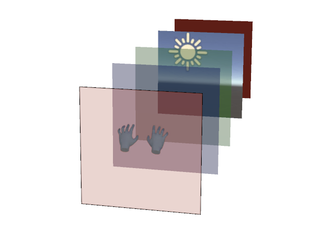

# About Composition Layers

Composition Layers allow application developers to define areas in a scene or view that are composited separately from the normal 3D rendering. Rendering to a composition layer can provide sharper rendering compared to normal scene rendering. Device makers can also provide their own composition layers to support features like pass-through video or hardware-accelerated video.

The Composition Layers package defines a few common layer types and provides extension mechanisms that allow plug-in authors to add new layer types or add custom extensions to support their specific needs or features.

## Installation

To install this package, follow the [Installation instructions](xref:xr-layers-install).

[Using Composition Layers]: xref:xr-layers-using
[ILayerProvider]: xref:UnityEngine.XR.CompositionLayers.Provider.ILayerProvider
