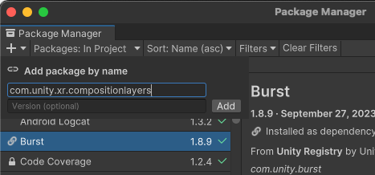

# Install  XR Composition Layers

XR Composition Layers is an official Unity package available via the [Package Manager](https://learn.unity.com/tutorial/the-package-manager).

## Editor compatibility

This version of Composition Layers is compatible with Unity Editor version 2022.3 and later.

## Required packages

The XR Composition Layers package contains interfaces, types, and emulation for accessing composition layers, but does not provide a runtime implementation. To use composition layers at runtime, you must also install an XR Provider plug-in that implements the [ILayerProvider](xref:Unity.XR.CompositionLayers.Provider.ILayerProvider) interface.

| Provider plug-in package | Version |
| :----------------------- | :------ |
| OpenXR                   | [1.15.1](com.unity3d.kharma:upmpackage/com.unity.xr.openxr@1.15.1)   |

Please note for older versions of Composition Layers there are different versions of the OpenXR package that are compatible. The following chart highlights the compatibility between past Composition Layers and OpenXR package versions.

|Composition Layers Package Version | OpenXR Package Version |
| :--- | :--- |
|`2.4.0` | `1.15.1`+
|`2.3.0` | `1.15.1`+
|`2.2.0` | `1.15.1`+
|`2.1.0` | `1.14.3`+
|`2.0.0` | `1.14.0`+
|`1.0.0` | `1.13.0`
|`0.6.0` | `1.12.1-exp.1`
|`0.5.0` | `1.11.0-exp.1`

## Installation

To install this package in Unity 2022.3+:

1. Open the project that you plan to use.
2. Click the following link: [com.unity.xr.compositionlayers](com.unity3d.kharma:upmpackage/com.unity.xr.compositionlayers).

   The Unity Package Manager window opens with the package name entered in the **Add package by name** dialog.

   

3. (Optional) Enter the full version number, such as `2.0.0`, to install. If left blank, Unity chooses the "best" version -- typically the latest, release version for the current Unity Editor.  Refer to the [Changelog](xref:xr-layers-changelog) for a list of versions available at the time this documentation page was published.
4. Click **Add**.

After you install the package, refer to [Settings](xref:xr-layers-settings) for additional configuration information.

## Other common XR packages

The following table outlines the recommended versions for other common XR packages when using composition layers <code class="long_version">2.4.0</code>:

| Package | Version |
|:--------|:--------|
| Unity OpenXR: Meta | [2.3.0](https://docs.unity3d.com/Packages/com.unity.xr.meta-openxr@2.3/manual/index.html)+ |
| Unity OpenXR: Android XR | [1.1.0](https://docs.unity3d.com/Packages/com.unity.xr.androidxr-openxr@1.1/manual/index.html)+ |
| Meta XR Core SDK | [81.0](https://developers.meta.com/horizon/reference/unity/v81/)+ |

