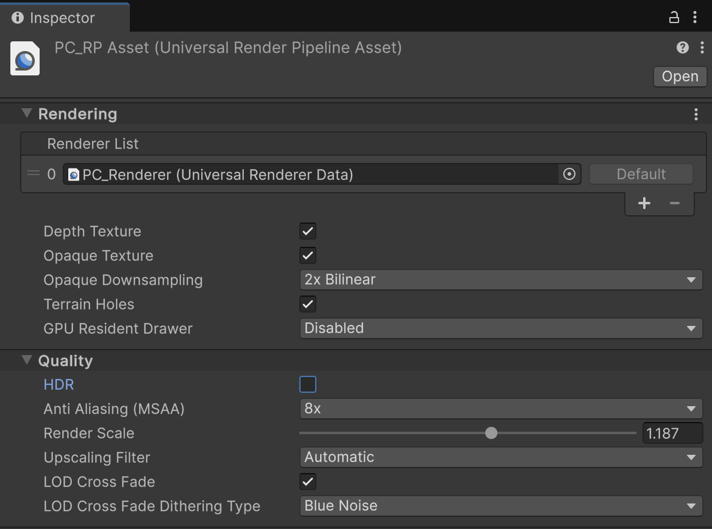
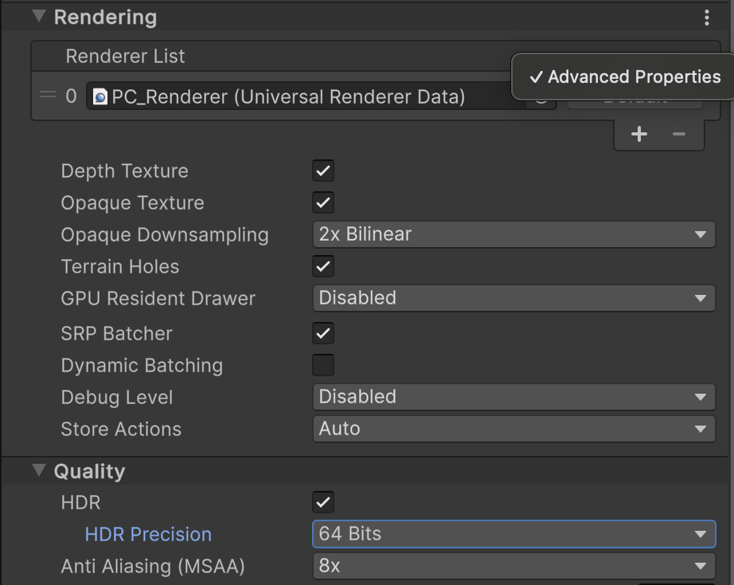
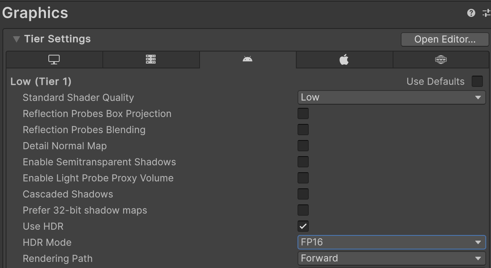
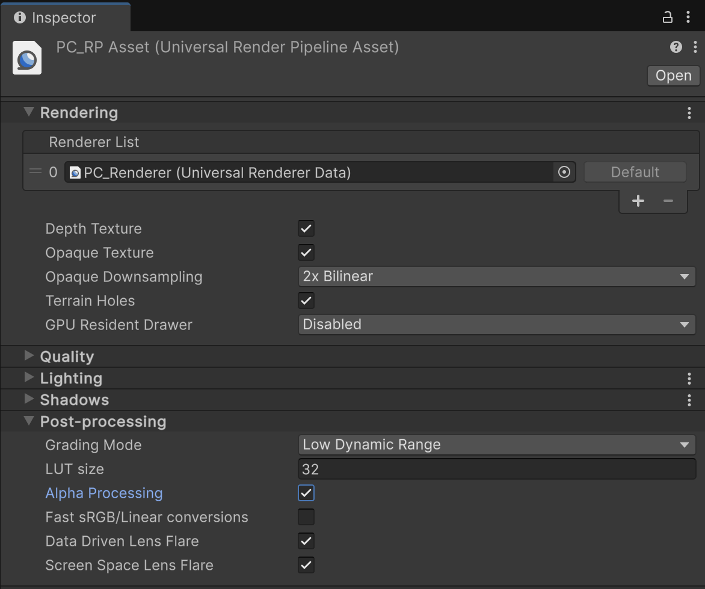
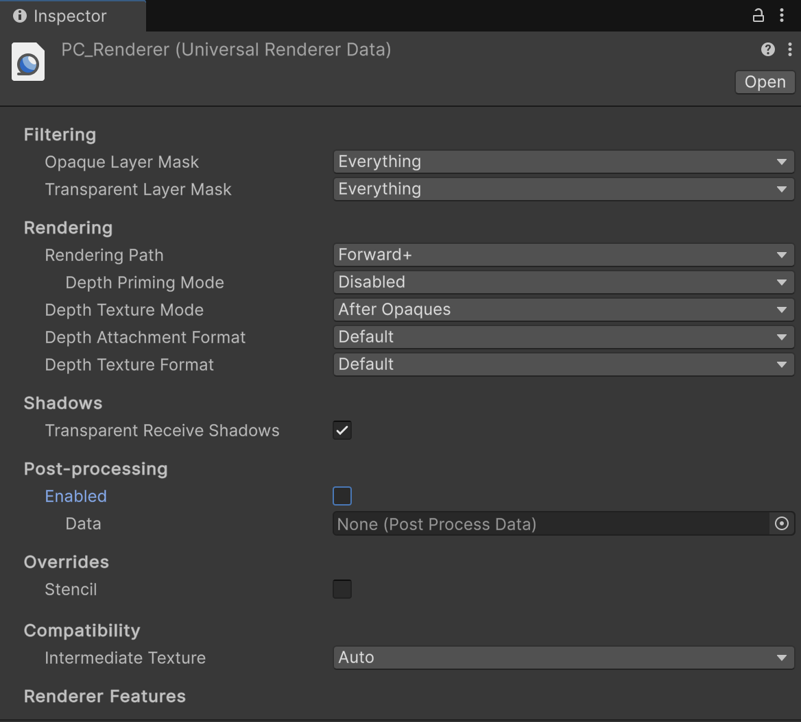
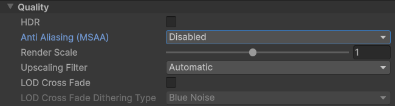
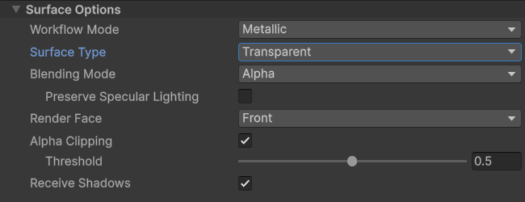

# Composition layer transparency

Composition layers are drawn in order from most negative to most positive. A completely opaque area of a layer obscures any layers already drawn. To use alpha blending to allow lower layers to show through upper layers, you must **manually configure** camera, HDR, and Post-processing settings:

* [Configure the camera for transparency](#camera-transparency)
* [Configure HDR settings](#hdr-transparency)
* [Configure Post-processing settings](#post-processing-transparency)
* [Disable alpha-to-coverage](#alpha-to-coverage)

If you do not configure these settings correctly, the following types of layers might not render correctly:

- Underlays (layers with compositing order < 0)
- Transparent layers
- Projection Eye Rigs

> [!TIP]
> Layers that are drawn underneath the main scene are sometimes called **underlays** and those that are drawn on top are sometimes called **overlays**. While the XR Composition Layers package doesn't use these terms explicitly, you might see them used in other XR literature. The main camera renders to the default scene layer, which always has an order of zero. Layers with a negative order are drawn underneath this layer and correspond to **underlays**. Layers with a positive order are drawn on top and correspond to **overlays**.

> [!NOTE]
> Compositing in the Editor is emulated by shaders and can produce different results than the hardware compositor on an XR device. Always verify your layer setup on device.

## Configure the camera for transparency {#camera-transparency}

Unity renders the main camera to the default scene layer, which is drawn at order zero. By default, the camera background is completely opaque and obscures anything in layers with a negative order value. Set the camera background to transparent to allow layers with a negative order (underlays) to be seen.

To configure the main scene camera in an XR scene to render with a transparent background:

1. Select the **Camera** GameObject in the scene Hierarchy (typically under **XR Origin** > **Camera Offset**).
2. Adjust settings based on your render pipeline:
    - **Universal Render Pipeline (URP)**:
     In the **Environment** section, set **Background Type** to **Solid Color**.
    - **Built-In Render Pipeline**:
     Set **Clear Flags** to **Solid Color**.
3. Open the **Background** color picker and set **A (Alpha)** to `0`.

The same considerations apply when you render objects to a render texture and use that texture as the source of a composition layer. If you want layers underneath to be visible in the background areas, you must set the rendering camera's background color to be transparent.

> [!NOTE]
> The cameras of the **Projection Eye Rig** use a transparent background by default.

## Configure High Dynamic Range (HDR) settings {#hdr-transparency}

In order to store information to the alpha channel, the format of the render texture the scene is rendered to must contain an alpha channel. Some HDR rendering formats drop alpha channels for improved performance, but this can prevent layers underneath the default scene layer from being visible.

If you are using HDR, ensure your graphics Quality or Tier settings are set to allow the scene to be rendered with an alpha channel. Otherwise, you must disable HDR in the project settings.

Refer to [HDR Tone mapping component] for information about the Composition Layers tone mapping component.

### Universal Render Pipeline (URP)

To change HDR settings when using URP:

> [!TIP]
> By default, the PC_RP Asset configures URP settings for standalone builds (Windows, macOS, Linux), while the Mobile_RP Asset optimizes settings for Android builds. Ensure you modify all the correct RP Asset and Renderer for your target platform.

1. Locate your project's render pipeline assets. (By default these assets are stored in the `Assets/Settings` folder in the Project.)
2. For each render pipeline asset:

   a. Select the asset to view its properties in the Inspector.
   b. In the **Quality** section, enable or disable **HDR**.
   c. If you enable HDR, set **HDR Precision** to **64 Bits**.

 *Disabling the **HDR** setting in a render pipeline asset*

 *Modifying the **HDR** Percision setting in a render pipeline asset*

> [!NOTE]
> If the Inspector doesn't show the **HDR Precision** setting, you must change the [Advanced Properties preference](https://docs.unity3d.com/Packages/com.unity.render-pipelines.core@latest?subfolder=/manual/advanced-properties.html#exposing-advanced-properties-on-preferences) to **All Visible**:
>
> 1. Open the Unity [Preferences](xref:um-preferences) window.
> 2. Select the **Graphics** section.
> 3. Set the **Advanced Properties** setting to **All Visible**.

### Built-In Render Pipeline

> [!IMPORTANT]
> In Unity 6.5 and newer, the Built-In Render Pipeline is deprecated and will be made obsolete in a future release. For more information, refer to [Migrating from the Built-In Render Pipeline to URP](https://docs.unity3d.com/6000.5/Documentation/Manual/urp/upgrading-from-birp.html) and [Render pipeline feature comparison](https://docs.unity3d.com/6000.5/Documentation/Manual/render-pipelines-feature-comparison.html).

To change HDR settings when using the Built-In Render Pipeline:

1. Open the **Project Settings** window.
2. Select the **Graphics** section.
3. Locate the **Tier Settings** for **Built-In**.
4. Click the **Open Editor** button to open the **Tier Settings** editor.
5. Change the HDR settings to the desired value for each tier that your project uses:

   a. Deselect the **Use Defaults** option.
   b. Enable or disable the **Use HDR** option.
   c. If you enable HDR, set **HDR Mode** to **FP16**.

 *FP16 mode in Graphics Tier Settings*

Refer to [Graphics settings](xref:um-class-graphics-settings) for the version of Unity that you are using for more information about changing graphics settings.

## Configure Post-processing settings {#post-processing-transparency}

Post-processing effects in URP may discard alpha channel data. To preserve the composition layer alpha channel, enable **Alpha Processing** or disable Post-processing entirely.

To enable **Alpha Processing**:

1. Locate your project's render pipeline assets. (By default these assets are stored in the `Assets/Settings` folder in the project.)
2. For each render pipeline asset:

   a. Expand the **Post-processing** section, if necessary.
   b. Enable **Alpha processing**.

 *Enabled **Alpha Processing** setting in a render pipeline asset*

To disable Post-processing:

1. Locate your project's Universal Renderer Data assets. (By default these assets are stored in the `Assets/Settings` folder in the project.)
2. For each renderer data asset, uncheck the **Enabled** option in the **Post-processing** section.

 *Post-processing disabled in a renderer data asset*

Refer to [Post-processing in URP](xref:um-post-processing-in-urp) for more information about Unity post-processing features.

[HDR Tone mapping component](xref:xr-layers-hdr-tonemapping)

## Disable alpha-to-coverage {#alpha-to-coverage}

Alpha-to-coverage isn't compatible with composition layers when rendering behind the scene layer if alpha cutout materials are present in the scene.

Alpha-to-coverage converts the alpha channel into a coverage map. Alpha-to-coverage can result in holes in the scene layer, which means the compositor can't correctly render layers behind the scene layer.

The Universal Render Pipeline Lit shader enables alpha-to-coverage when you enable Multisample Anti-aliasing (MSAA) in your project and if your scene materials with an opaque surface type.

To prevent alpha-to-coverage problems in your project, you can:

### Disable MSAA

Disabling MSAA disables alpha-to-coverage globally. To disable MSAA:

1. Locate your project's render pipeline assets. (By default Unity stores render pipeline assets in the `Assets/Settings` folder in the project.)
2. For each render pipeline asset, open it in the **Inspector**, and under **Quality**, set **Anti Aliasing (MSAA)** to **Disabled**.

 *Disabled **Anti Aliasing (MSAA)** setting in a render pipeline asset*

### Use transparent surfaces for your URP Lit materials

Modify your [URP Lit shader materials](xref:urp-lit-shader) that use alpha cutout (or alpha test) to use the transparent surface type as follows:

   1. Open the material for your objects in the **Inspector**.
   2. For each material, set the **Surface Type** to **Transparent**.

 *A material with the surface type set to **Transparent**.*
