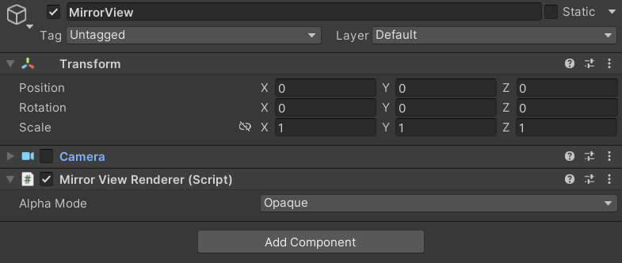

# Mirror View Renderer

The `MirrorViewRenderer` supports mirror view rendering for Main Display on XR mode. It includes all composition layer drawings.

> [!TIP]
> This component is not required if mirror view rendering with all comosition layers is already implemented on the XR plugin side.

 *The Mirror View Renderer Component Inspector*

| Property:| Function: |
|:---|:---|
| Alpha Mode| Set how draw the eye texture. (**Opaque, Alpha and Premultiply**) |

## Background

In some case, the mirror view rendering with composition layers isn't supported by default.
- Some XR Plugins
- Built-in Render Pipeline

This function is provided to assist them.

> [!IMPORTANT]
> In Unity 6.5 and newer, the Built-In Render Pipeline is deprecated and will be made obsolete in a future release. For more information, refer to [Migrating from the Built-In Render Pipeline to URP](https://docs.unity3d.com/6000.5/Documentation/Manual/urp/upgrading-from-birp.html) and [Render pipeline feature comparison](https://docs.unity3d.com/6000.5/Documentation/Manual/render-pipelines-feature-comparison.html).

## Supplement

Below shaders are added to the **Always Include Shaders list** when the MirrorViewRenderer is added.
- Unlit/XRCompositionLayers/Uber
- Unlit/XRCompositionLayers/BlitCopyHDR
