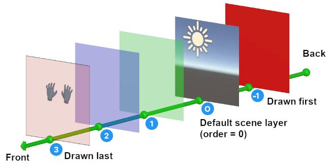

# Composition layers

Composition layers are essentially textures that are presented to the device runtime to be composited into the final display shown to the user. At least one layer always exists and your scene content is projected to this layer through the stereo eye cameras.

The XR Composition Layers package allows you to create application-defined layers and specify the order in which they are drawn. You can use composition layers for purposes such as:

* Improved clarity and sharpness: elements like text, video, and UI can be rendered with more clarity in a composition layer because the content does not need to go through the standard eye projection.
* 360° images and video: A special purpose type of layer is available to render equirectangular images and video.
* Cube maps: a special purpose type of layer is available for rendering cube maps.
* Secure content: device runtime makers can add support for content such as video that must be displayed, but shouldn't be accessible to the application code itself. This might include DRM-protected video or passthrough video. Note that the Composition Layer package does not include this type of layer. It does provide an extension mechanism so that a device maker can create such layers.
* Hardware acceleration: device makers can add support layers that can take advantage of hardware capabilities of their device, such as hardware decoding of video.
* Android Surface integration: You can directly use Android Surface content to efficiently render graphics or display content such as hardware-decoded video. Refer to [Display Android Surface content](xref:xr-layers-android-surface) for more information.

While useful in specific situations, each composition layer you add to a scene has an impact on performance. Unity recommends that you use no more than fifteen composition layers in a scene. You should always assess the performance impact of your composition layer usage on your target hardware.

## Composition layer drawing order

The compositor in a device draws your layers in the assigned order starting from the most negative order value. In the following diagram, for example, the layers are composited in the order: -1, 0, 1, 2, 3. (The assigned values do not need to be consecutive.)

  *The "[painter's algorithm](https://en.wikipedia.org/wiki/Painter%27s_algorithm)" is used to draw layers*

Layers are blended according to their alpha channel. A completely opaque area of a channel obscures the layers drawn before it.

Some types of composition layers have a position, orientation, and size within the scene. The compositor draws these types of layers in the assigned order without regard to their world position. Thus, if you have two quad composition layers in a scene, the quad with the higher order assigned is drawn on top of the other quad even when it is behind the other quad relative to the scene cameras.

Refer to [Change layer order](xref:xr-layers-order) for more information on managing the order of layers in your project.

> [!NOTE]
> Layer order is the only factor that determines how layers are stacked relative to one another. World-space Z-depth, camera depth, shader queue ordering, and all other standard Unity rendering rules do not influence how composition layers are stacked by the XR compositor.

## Types of composition layers

To add a composition layer to a scene, you add a **Composition Layer** component to a GameObject in the scene and set its **Type** property.

The basic, Unity-defined Composition Layer types include:

* __Cube layer__: a cube always centered at the user's head position with only its inside faces visible. You can assign cube map textures. Useful for skyboxes and rendering 360 panoramic images.
* __Cylinder layer__: a curved, rectangular, "in-scene" display area. You can assign a texture to be rendered to this area, which could be a render texture to provide a dynamic display. Only the inside face of the cylinder is visible.
* __Equirect layer__: a sphere, "in-scene" display area. You have the flexibility to adjust and modify the shape of the sphere, and can assign a texture to be rendered to this area, which could be a render texture to provide a dynamic display. Only the inside face of the sphere is visible.
* __Projection layer__: a layer represents planar projected images rendered from the eye point of each eye using a standard perspective projection. This layer requires two textures coming from the position of each eye.
* __Quad layer__: a flat, rectangular, "in-scene" display area. You can assign a texture to be rendered to this area, which could be a render texture to provide a dynamic display. Only the front face of the quad is visible.

The Unity scene is rendered to Projection layer. This __Default Scene Layer__ is created automatically and its layer order of __0__ cannot be changed.

Other XR packages and provider plug-ins can define additional layer types.

## The default scene layer

The stereo view of the Unity scene, containing all the visible GameObjects, particles, and visual effects is rendered into a default scene layer, which is always assigned the order of zero. Normally, this layer is completely opaque and obscures anything in layers with a negative order value. You can set the background of this layer to be transparent in order to see layers composited behind it. Refer to [Set layer transparency](xref:xr-layers-transparency) for more information.

Any layers with positive order are composited on top of the scene layer, and thus, on top of all your GameObjects. To show GameObjects in front of a composition layer, you can render them using different cameras and display the rendered texture in a separate Projection-type composition layer that you order in front. The XR Composition Layers package provides the [Projection Eye Rig](xref:xr-layers-projection-eye-rig) to automatically set up a composition layer and cameras for this purpose.

## Best practices example

Consider the following common practices in your composition layers project:

* Rendering the Skybox as an underlay (layer order less than 0) using Cube/Equirect layer types. In order to use underlays in your project, refer to [Set layer transparency](xref:xr-layers-transparency).
* The Default scene layer is always assigned the order of zero.
* High priority GameObjects such as XR Hands/Controllers are placed above the UI content layers using the [Projection Eye Rig](xref:xr-layers-projection-eye-rig).
* Layer orders are condensed around 0 and avoid unnecessarily large ranges or gaps.
* Keep the total number of layers low to maintain good performance (Unity recommends that you use no more than fifteen composition layers in a scene).

The following table demonstrates a common ordering of layers for an XR application.

| Layer                     | Type               | Order |
|:--------------------------|:-------------------|:-----:|
| Skybox                    | Cube/Equirect      |  -1   |
| Default scene layer       | Projection         |   0   |
| UI content (e.g. menus)   | Quad/Cylinder      |  1-3  |
| XR Hands/Controllers      | Projection Eye Rig |   4   |

## Layer extension components

Layer extensions are components that you use to assign data to a composition layer. For example, the **Source Texture** component is the extension you use to define the texture to display in a composition layer.

The Unity-defined layer extensions include:

* [Color Bias and Scale extension](xref:xr-layers-color-bias-scale): applies a color treatment, such as a tint, to the texture displayed in the composition layer.
* [Source Textures extension](xref:xr-layers-source-textures): defines the texture assets to display in a composition layer.

Other XR packages and provider plug-ins can define additional layer extension components.

## Compositor layer emulation

In-editor layer emulation provides rough visual approximation of your composition layers and layers will display differently on devices. As such, you should only rely on layer emulation to check rough layout and previews. Emulation In Playmode or Standalone is only available when no XR provider is active or no headset connected.

If your project uses URP, then you must configure the [Emulation Layer Renderer Feature (URP)](xref:xr-layers-settings#emulation-layer-renderer-feature).

## Platform support

Composition layer support replies on platform implementation. Not all features are available on all platform

### OpenXR runtimes

The following table lists the supported features for each OpenXR runtime:

| Feature              | Meta Quest | Android XR | SteamVR |
|:---------------------|:----------:|:----------:|:-------:|
| Cube Layers          |    Yes     |    Yes     |         |
| Cylinder Layers      |    Yes     |    Yes     |         |
| Equirect Layers      |    Yes     |    Yes     |         |
| Projection Layers    |    Yes     |    Yes     |   Yes   |
| Quad Layers          |    Yes     |    Yes     |   Yes   |
| Color Bias and Scale |    Yes     |    Yes     |         |
| HDR Tonemapping      |            |            |         |
| Android Surfaces     |    Yes     |    Yes     |         |
