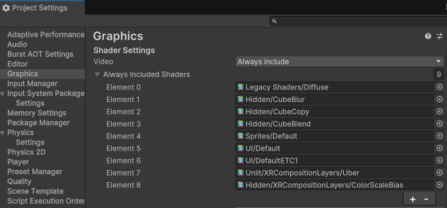
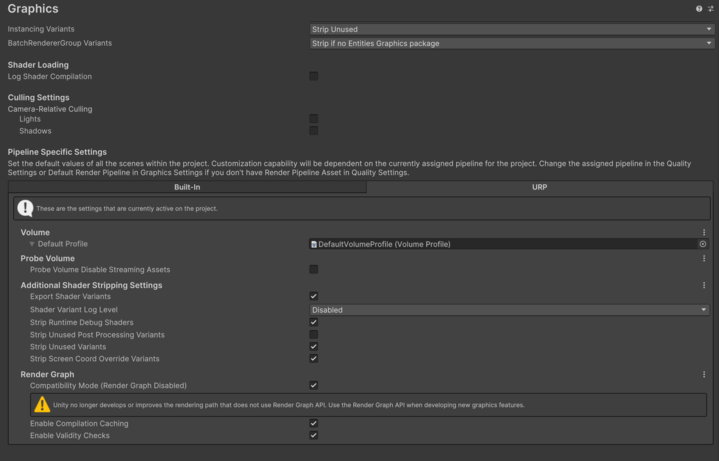

# Settings

The XR Composition Layers package provides some preferences that determine how composition layers are displayed in the Editor. There are also some [graphics settings](#graphics-settings) that you must adjust to ensure that the composition layers display correctly in the Editor and at runtime.

## Preferences

The XR Composition Layers package adds the following settings to the Unity **Preferences**:

| Setting | Description |
| :------ | :---------- |
| **Display Angles As** | Choose whether the various angle values that you can set in the Composition Layer components use **degrees** or **radians**. |
| **Emulation in Scene** | Show composition layers in the Scene view. |
| **Emulation In Play Mode** | Show composition layers in the Game view while in Play mode when no XR provider is active or no headset connected. |

> [!TIP]
> Emulation of composition layers is not perfect and can sometimes interfere with normal scene editing and troubleshooting. You can use the emulation preferences to turn off emulation in such cases.

Refer to [Preferences](xref:Preferences) for more information about the Unity Editor **Preferences** window.

## Runtime settings

To enable layer emulation in a standalone **Win, Mac, Linux** build:

1. Navigate to the **Assets/CompositionLayers/UserSettings/Resources** folder in your **Project** window. (This folder is created automatically when you import the XR Composition Layers package.)
2. Select the **CompositionLayersRuntimeSettings** asset to view its properties in the **Inspector**.
3. Enable the **Emulation in Standalone** option.

> [!TIP]
> You must also add the **Uber** shader to the [Always Include Shaders list](#always-include-shaders-list) to make sure that this shader, which is needed to render emulated layers, is included in your standalone builds.

## Graphics settings

XR Composition Layers Emulation relys on a specific shader that must be added to the [Always Include Shaders list](#always-include-shaders-list) for the project.

If the project uses the Universal Render Pipeline (URP), the [Emulation Layer Renderer Feature](#emulation-layer-renderer-feature) is automatically added.

If the project uses the High Definition Render Pipeline (HDRP), the [Emulation Layer Custom Pass](#emulation-layer-custom-pass) is automatically added to the global `CustomPassVolume`.

### Always Include Shaders list

For compostions layer emualtion, when a standalone **Win, Mac, Linux** build is detected, the `Unlit/XRCompositionLayers/Runtime/Uber` and `Hidden/XRCompositionLayers/ColorScaleBias` shaders are automatically added to the always include shaders list.

 *The __Always Included Shaders__ list with the Uber and ColorScaleBias shaders added*.

> [!TIP]
> Make sure that the **Emulation in Standalone** setting is enabled under [Runtime settings](#runtime-settings).

### Emulation Layer Renderer Feature (URP)

To support layer emulation in projects using the Universal Renderer Pipeline (URP), the `EmulationLayerUniversalScriptableRendererFeaturePass`(ScriptableRendererPass) is automatically added with `ScriptableRenderer.EnqueuePass()`.
To support Color Bias Scale emulation in projects using the Universal Renderer Pipeline (URP), the `EmulationColorBiasScalePass` (ScriptableRendererPass) is automatically added with `ScriptableRenderer.EnqueuePass()` when the `Color Bias and Scale` component is added to the Default Layer.

> [!TIP]
> No need to `Add Renderer Feature` to the Universal Renderer Data asset. It had to be set manually in the past version.

> [!NOTE]
> If using Underlays with URP in Unity 6, Compatibility Mode (Render Graph Disable) must be selected to render emulated underlay layers.
1. Open the **Project Settings** window (menu: **Edit > Project Settings**).
2. Select the **Graphics** section.
3. Click on the URP Tab.
4. Under the Render Graph section select **Compatibility Mode (Render Graph Disable)** button.

   

### Emulation Layer Custom Pass (HDRP)

To support layer emulation in projects using the High Definition Render Pipeline (HDRP), the `EmulationLayerHighDefinitionOverlayCustomPass` and `EmulationLayerHighDefinitionUnderlayCustomPass` are automatically added to the global `CustomPassVolume`.
The GmaeObject which has CustomPassVolume is hidden in hierarchy.
