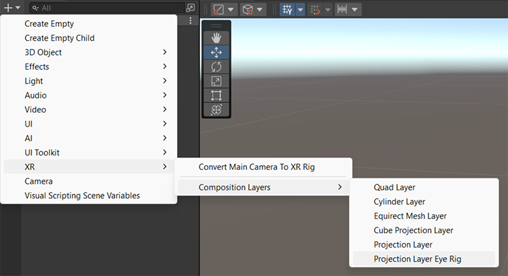
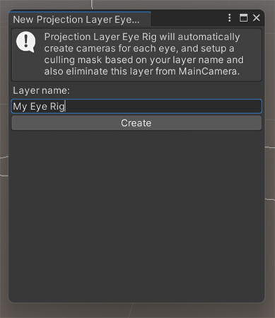
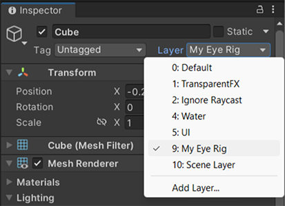

# Projection Eye Rig

The **Projection Eye Rig** a special projection layer prefab that allows you to render scene objects on a different projection layer than the Default Scene Layer.

> [!IMPORTANT]
> Ensure that **Run Without Focus** is enabled in the Player Settings. Otherwise, when the application loses focus, objects shown in the Projection Eye Rig layer will not update correctly and will appear locked to the user's head. You can find the **Run Without Focus** setting in the **Resolution and Presentation** section of your project's Player settings and Build Profiles. The setting is available for the Android, Android XR, and Meta Quest platforms.

## Create a Projection Eye Rig

You can create a Projection Eye Rig in the same way you would create a composition layer, via the add GameObject dropdown menu.

 *The CompositionLayer Dropdown Menu*

At this point you will be prompted to enter a layer name for the eye rig.

 *Projection Eye Rig Name Prompt*

The layer name you enter is used to name the eye rig, and also assigned to an unused Unity Layer. This Unity layer is in the culling layer mask to determine which GameObjects in the scene are rendered to the Projection Eye Rig and which are rendered to the default scene layer.

## Assign GameObjects to the Projection Eye Rig

To assign scene GameObjects to render to the Projection Eye Rig, go to the Inspector of the object and assign its **Layer** to the Unity Layer with the same name as the Projection Eye Rig.

 *Assign object to eye rig*

This action will cull the object from the main camera, and add it to the hidden camera(s) of the Projection Eye Rig, thereby rendering it on a different Projection Layer.

## Emulation of the Projection Eye Rig

Unlike the standard Projection Layer where you can manually assign textures to the layer, the Project layer eye rig will not allow for texture assignment. Instead it will generate its own textures from a number of cameras that mimic the active cameras during edit time, play mode, and runtime.

In edit time, the eye rig will follow the Scene Camera. During Play Mode, it will follow the Main Camera, and at runtime it will render from the two eye cameras.
