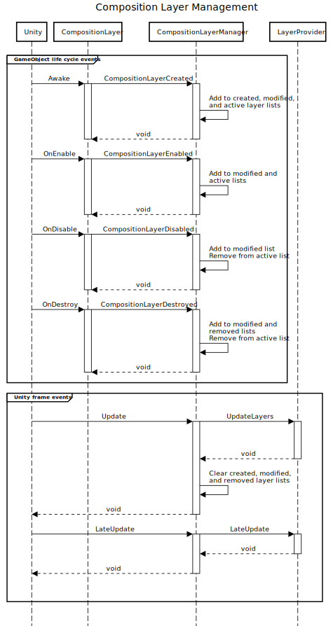
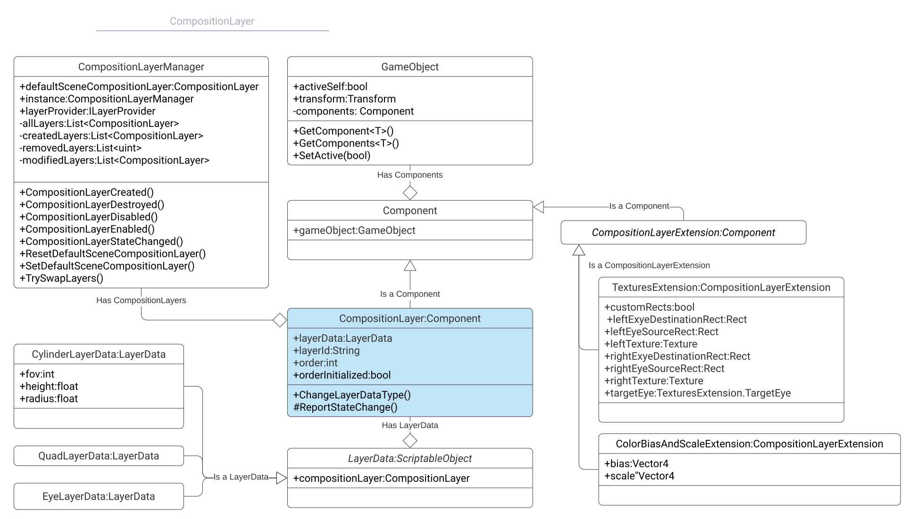

# Provider implementation guide

This document outlines how to implement Composition Layers for a specific hardware API. You should also familiarize yourself with the topics in [Using Composition Layers] to better understand user expectations.

The Composition Layer API provides a fair amount of leeway in how you implement Composition Layers for your device. You can add your own layer types and extensions as needed. When implementing the standard, Unity-defined layers and extensions, you should conform to the documented behavior to the extent possible to allow application developers to port their applications to your device with minimal effort.

> [!IMPORTANT]
> This section of the Composition Layer documentation discusses how to implement a plugin to support these layers on an XR device. If you are developing an XR application and want to use layers in your application, see [Using Composition Layers] instead.

## Composition layer elements

There are five main pieces to the Composition Layers API:

* [CompositionLayerManager]\: manages composition layers and communicates changes to the active Layer Provider. The singleton manager object is implemented by Unity in this xr.sdk.compositionlayers package. API: [CompositionLayerManager].
* [ILayerProvider]: the main interface between your device layer code and the Unity runtime. API: [ILayerProvider].
* [CompositionLayer]: the base class for composition layer implementations. Extend this class to define your own layer types. You should also handle the standard, Unity-defined layer types when appropriate. API: [CompositionLayer].
* [LayerData]: every composition layer type must have a corresponding layer data type. You can define additional data fields needed by your layer type in this implementation. API: [LayerData].
* [CompositionLayerExtension]: an abstract class you can use to define data that can be used by different layer types. API: [CompositionLayerManager].

## Composition Layer Manager

The CompositionLayerManager manages all the currently known layers and communicates that information to your Layer Provider instance.

The manager maintains an internal list of composition  layers. As game events occur that affect layers, such as layers being created, destroyed, enabled, and disabled, the manager communicates these changes to the provider implementation during the Update portion of the Unity frame. Every Unity frame, the manager calls your provider implementation's [UpdateLayers] method, passing the following lists as parameter:

* Active layers: all layers that aren't disabled or destroyed
* Created layers: any layers created since the last update
* Modified layers: any layers that have been created, enabled, disabled, or destroyed since the last update
* Removed layers: any layers that have been disabled or destroyed since the last update

The manager calls the [UpdateLayers] method during the [standard Unity Update event].

The manager also calls the provider's [LateUpdate] method during the [standard Unity LateUpdate event]. The manager does not pass any information using this method, but you can use your provider's `LateUpdate` method implementation to handle any tasks that need to be performed at the end of the "game logic" section of the Unity frame. See [Order of execution for event functions] for more information about the Unity frame.

Each composition layer instance is responsible for informing the manager instance when it is created, enabled, disabled, or destroyed. The base [CompositionLayer] implementation handles this communication using the standard GameObject life cycle events. (If you override these event functions in your own CompositionLayer subclass, be sure to call the base class methods.)
The following sequence diagram outlines how the messages are sent from Unity to the manager and layer components and, finally, to the provider:


<br />*Event message sequence*

## Layer Provider

The [ILayerProvider] interface defines the API between the Composition Layer package and any provider that wishes to implement composition layer rendering for their package. On every frame the [CompositionLayerManager] updates the current [ILayerProvider] instance with the current added, removed, modified, and active layers by calling the [ILayerProvider.UpdateLayers] method implementation.

An [ILayerProvider] instance may ask each Composition Layer for whatever instances of the Composition Layer Extension component it has and may use that information to apply changes or updates to default layer state. A provider implementation should ignore any extension data that it does not understand.

The information available from a layer includes:

* The [CompositionLayer] type
* The GameObject Transform
* Properties or fields of the [LayerData] object associated with the layer type
* Associated [CompositionLayerExtension] components on the same GameObject

The following class diagram illustrates the connections between the main classes in the XR Composition Layers API:


<br /> *Composition Layer API class diagram*

Use standard Unity [GameObject] methods to access other components related to a layer in a scene.

For example, from a [CompositionLayer] object passed to your provider by the manager, you can use [GameObject.GetComponents] to get all CompositionLayerExtension components of a specific type. You can get information, such as the GameObject [Transform] from the [gameObject.transform] property a [CompositionLayer] object inherits from the [Component] class.

A [CompositionLayer] also has a [LayerData] property that defines the type of layer it is and which might have additional data fields. (For example, the [CylinderLayerData] class provides data describing the cylinder's geometry.)

### Initializing a provider

See the [Unity XR SDK] documentation for information about implementing an XR plugin and setting up auto-discovery so that your plug-in's initialization function is called.

In the initialization function, assign an instance of your [ILayerProvider] implementation to the [layerProvider] field of the singleton [CompositionLayerManager] object:

``` csharp
CompositionLayer.instance.layerProvider = new LayerProviderImplementation();
```

The manager first calls [ILayerProvider.CleanupState] to give your provider the opportunity to clear any existing state if this is not the first time your implementation became the active layer provider. The layer then calls [ILayerProvider.SetInitialState], passing in a list of all composition layers (including any that are currently disabled).

## Default Scene Composition Layer

The Default Scene Composition Layer represents the target for rendering the Unity Scene. This Composition Layer is always at the 0th order in the Composition Layer Manager. Any Composition Layer with a Layer Order value < 0 is composited before the Default Scene Composition Layer and considered to be an Underlay, Any Composition Layer with an order value > 0 is composited on top of the Default Scene Composition Layer and is considered to be an Overlay. Final ordering in a composition is handled by the Layer Provider.
Normally the Composition Layer Manager provides the Default Scene Composition Layer but you can set a custom Composition Layers as default with SetDefaultSceneCompositionLayer or reset the Default Scene Composition Layer back to the one provided by the CompositionLayerManager with ResetDefaultSceneCompositionLayer.

## Creating new types of layers

Before creating a new type of layer, consider whether one of the existing types can be used instead. You might only need to add a new layer extension so that application developers can use it to supply the data you need.

To create a new type of layer, you must:

* Implement a [LayerData] subclass
* Create a Layer data descriptor, which is done using a [CompositionLayerDataAttribute] on your LayerData class

A [LayerData] implementation does not have any required members and can be as simple as:

``` csharp
using UnityEngine.XR.CompositionLayers.Extensions;
using UnityEngine.XR.CompositionLayers.Provider;

[CompositionLayerData(...)]
public class ProvidedLayerData : LayerData {}
```

You can add fields or properties for the data your layer implementation needs. Unity displays these fields in an [Inspector] window to allow application creators to assign values to them. (Optionally, you can create an [Editor] class to provide custom UI for the Inspector. You must create a custom Inspector UI in order for properties to be displayed.)

The [CompositionLayerDataAttribute] defines the following information, which the Composition Layer API uses to create the [ScriptableObject] describing your layer type:

| **Attribute value**        | **Purpose**                     | **Example**                                     |
| :------------------------- | :------------------------------ | :---------------------------------------------- |
| **Provider**              | Disambiguates layer types created by different providers.  | "Unity"               |
| **name**                  | A display name for the layer type. | "Quad"                |
| **id**                    | A string identifying this type. Use a reverse-DNS style id to minimize the chance for naming collisions with other providers. | "com.unity.layer.quad" |
| **iconPath**              | The path within your package to the layer icons used in the Editor. Specify the path relative to the Unity project folder. | "Packages/com.unity.xr.compositionlayers/Editor/Icons/"  |
| **inspectorIcon**         | An image asset in your package to display in the Inspector.| LayerQuadColor  |
| **listViewIcon**          | An image asset in your package to display in lists in the Editor (such as the Layer Order window.) | LayerQuad |
| **description**           | A description of the layer's purpose and capabilities.      | "Defines a simple quad layer in a scene. A quad layer is simply a rectangular area of the display that will be rendered with some texture by the current ILayerProvider instance." |
| **suggestedExtensionTypes** | An array of the layer extension classes that should be used with this type of Layer. The Unity Editor asks if these extensions should be added when you set the layer type. | new[] { typeof(TexturesExtension) } |

For complete examples, you can refer to the Unity-defined layer types, [ProjectionLayerData], [CylinderLayerData], and [QuadLayerData] classes in the Unity Composition Layer package.

## Creating new layer extensions

To implement a layer extension, subclass [CompositionLayerExtension] and define the fields and properties for your extension:

``` csharp
using UnityEngine.XR.CompositionLayers.Provider;

 [AddComponentMenu("XR/Composition Layers/Extensions/Custom")]
 public class CustomExtension : CompositionLayerExtension
 {
     [SerializeField]
     int m_CustomValue = 0;
}
```

[Component]: xref:UnityEngine.Component
[CompositionLayer]: xref:Unity.XR.CompositionLayers.CompositionLayer
[CompositionLayerDataAttribute]: xref:Unity.XR.CompositionLayers.Layers.CompositionLayerDataAttribute
[CompositionLayerExtension]: xref:Unity.XR.CompositionLayers.CompositionLayerExtension
[CompositionLayerManager]: xref:Unity.XR.CompositionLayers.Services.CompositionLayerManager
[CylinderLayerData]: xref:Unity.XR.CompositionLayers.Layers.CylinderLayerData
[Editor]: xref:editor-PropertyDrawers
[gameObject.transform]: xref:UnityEngine.Component.gameObject
[GameObject]: xref:UnityEngine.GameObject
[GameObject.GetComponents]: xref:UnityEngine.GameObject.GetComponents(System.Type)
[ILayerProvider.UpdateLayers]: xref:Unity.XR.CompositionLayers.Provider.ILayerProvider.UpdateLayers*
[ILayerProvider.CleanupState]: xref:Unity.XR.CompositionLayers.Provider.ILayerProvider.CleanupState*
[ILayerProvider.SetInitialState]: xref:Unity.XR.CompositionLayers.Provider.ILayerProvider.SetInitialState*
[ILayerProvider]: xref:Unity.XR.CompositionLayers.Provider.ILayerProvider
[Inspector]: xref:UsingTheInspector
[LateUpdate]: xref:Unity.XR.CompositionLayers.Provider.ILayerProvider.LateUpdate*
[Layer Order window]: xref:xr-layers-using#sort-order
[LayerData]: xref:Unity.XR.CompositionLayers.Layers.LayerData
[layerProvider]: xref:Unity.XR.CompositionLayers.Services.CompositionLayerManager.LayerProvider
[Order of execution for event functions]: xref:ExecutionOrder
[QuadLayerData]: xref:Unity.XR.CompositionLayers.Layers.QuadLayerData
[ScriptableObject]: xref:UnityEngine.ScriptableObject
[standard Unity LateUpdate event]: https://docs.unity3d.com/ScriptReference/MonoBehaviour.LateUpdate.html
[standard Unity Update event]: https://docs.unity3d.com/ScriptReference/MonoBehaviour.Update.html
[Transform]: xref:UnityEngine.Transform
[Unity XR SDK]: xref:xr-sdk
[UpdateLayers]: xref:Unity.XR.CompositionLayers.Provider.ILayerProvider.UpdateLayers*
[Using Composition Layers]: xref:xr-layers-using
