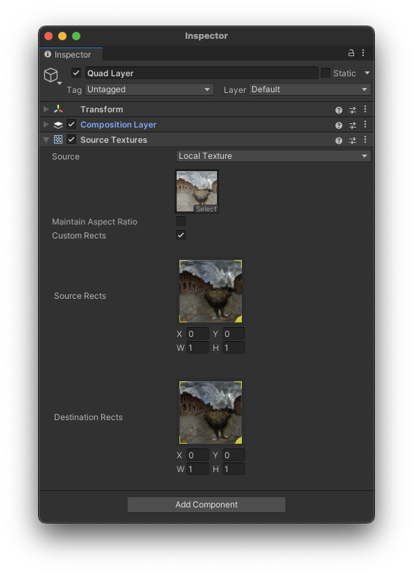
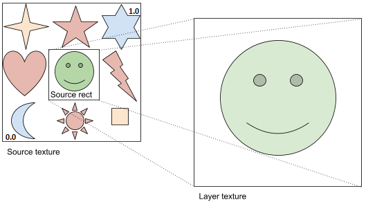
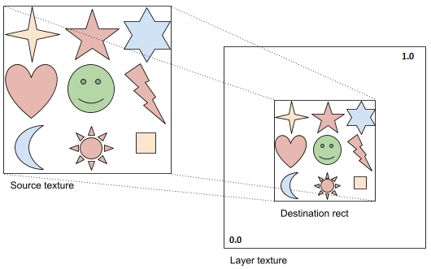

# Source Textures component

Add a Source Textures extension component to specify textures to render to a layer. See [Add or remove a composition layer]. On Android, for Quad and Cylinder layer types, you can also specify an [Android Surface](#android-surface) as the source texture.

 *The Source Textures component Inspector*

| Property:| Function: |
|:---|:---|
| Source | Specify the source of the texture - Local Texture or Android Surface. |
| Target Eye | Specify whether one texture is used for both eyes or an individual texture is used for each eye. Only shown for layer types that support stereo. |
| Texture (Local Texture Only)| Specify a texture to use. Click Select to choose a texture or drag-and-drop a texture onto the control with your mouse. |
| Resolution (Android Surface Only)| Specify the resolution for the Android Surface with X for width, and Y for height. |
| Maintain Aspect Ratio (Quad/Cylinder Layer/Android Surface Only)| Crop the layer to fit the aspect ratio of the texture. |
| In-Editor Emulation (Projection Layer Only)| Specify whether the left or right eye texture is shown in the Unity Editor. |
| Custom Rects| Enable to specify custom rects within the source and destination textures. |
| Source Rects1| Specifies a rectangle within the source texture to copy to the destination rather than copying the entire texture. Use your mouse to set the rect values or enter them into the x, y, w, and h fields. |
| Destination Rects1| Specifies a target rectangle within the destination texture to which to write the source texture rather than filling the entire destination texture. Use your mouse to set the rect values or enter them into the x, y, w, and h fields. |

1 Custom source rects and custom destination rects are not supported by composition layers of cube projection or equirect types.

> [!NOTE]
> Different types of composition layers support different texture settings. Only the settings supported by the current type of layer are shown in the Inspector.

## Custom source rects

You can use a custom source rect to define a rectangle subset of the source texture to use. The upper left of the source texture is coordinate (0,0) and the lower right is coordinate (1,1). Likewise, the full width and height are normalized to (1,1).

 *A source rect of approximately (.3, .3, .3, .3)*

## Custom destination rects

You can use a custom destination rect to define where to place the texture within a composition layer. The upper left of the layer is coordinate (0,0) and the lower right is coordinate (1,1). Likewise, the full width and height are normalized to (1,1).

 *A destination rect of approximately (.25,.25,.5,.5)*

## Android Surface

When developing for Android, you can use Android Surfaces for efficiently rendering graphics or displaying content such as hardware decoded video. Refer to [Display Android Surface Content](xref:xr-layers-android-surface) for more information.
